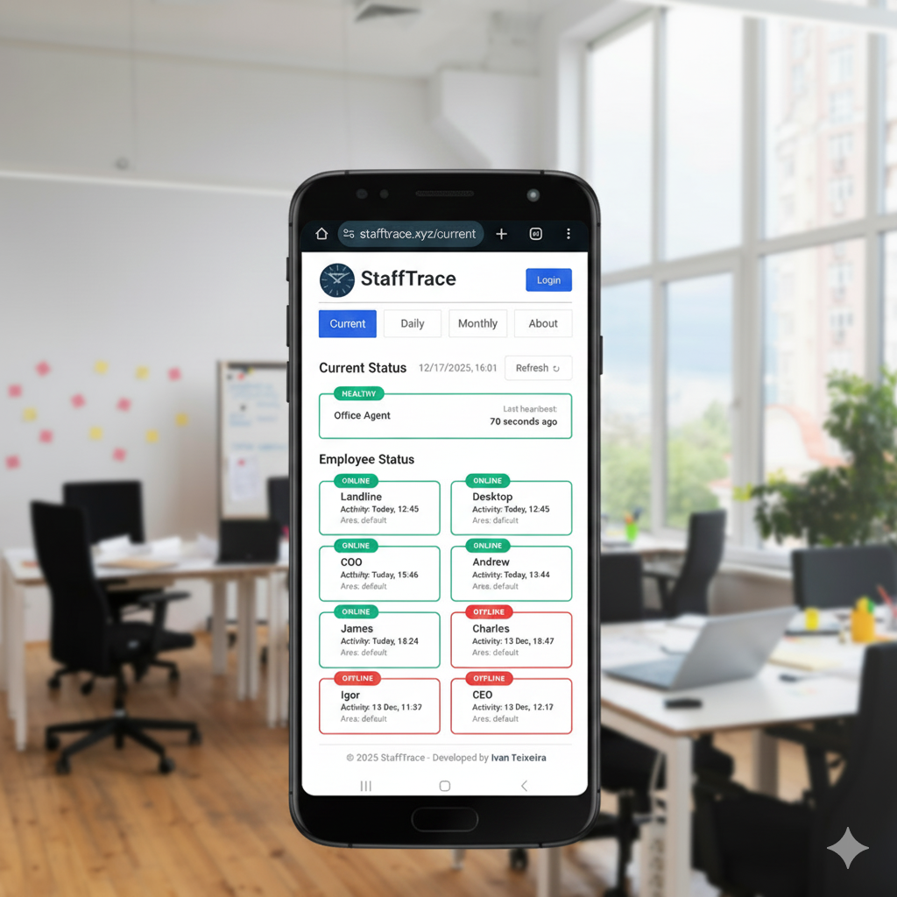
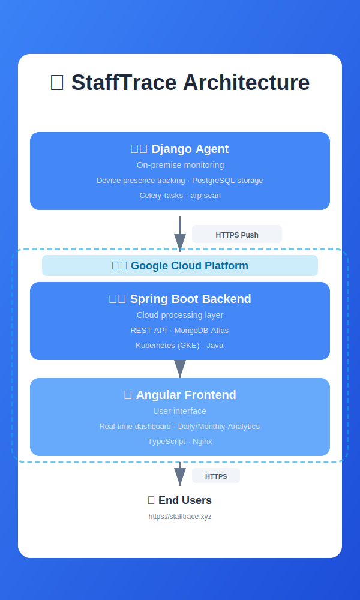
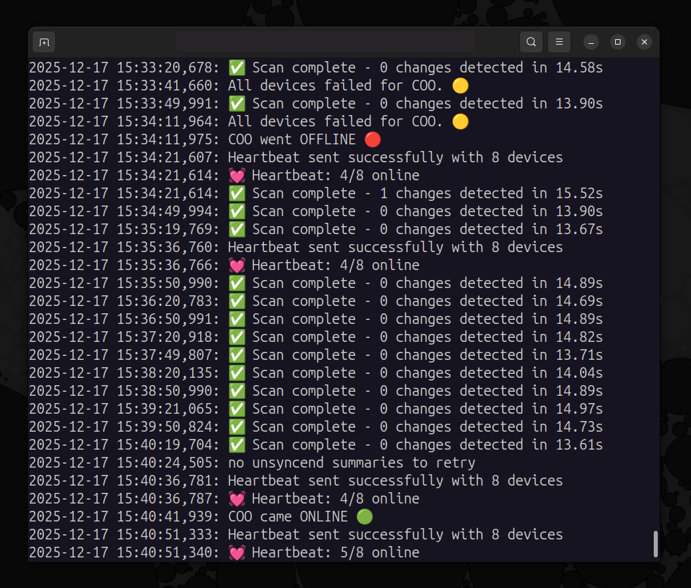
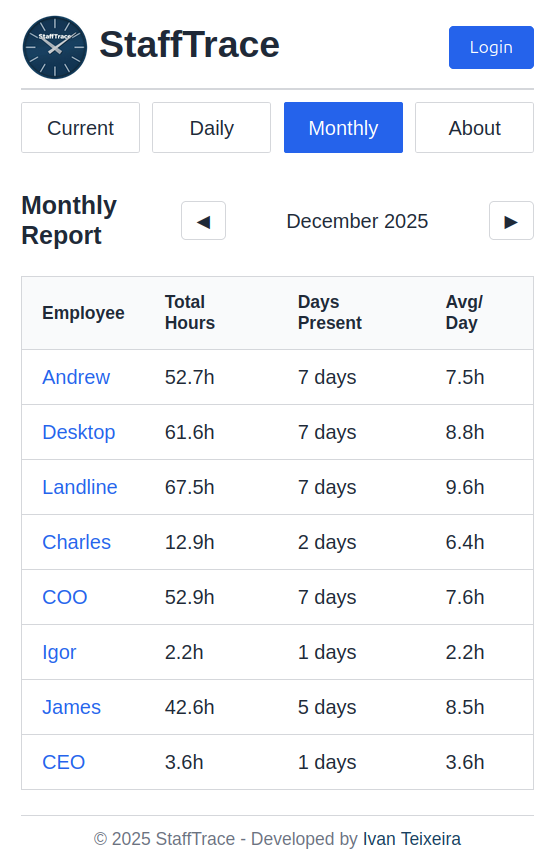
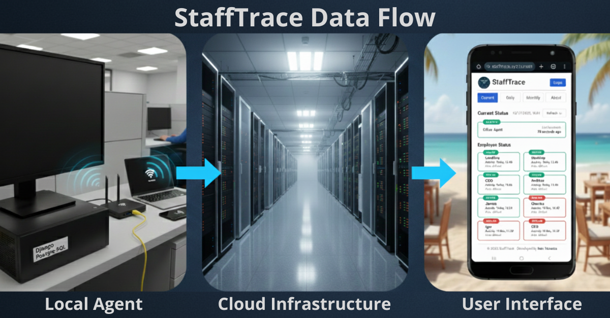

# StaffTrace - employee presense monitor

## What It Does

Employee presence monitoring system that tracks attendance via network connection state.

**Origin:** Needed a time clock. Had a dedicated Linux server and smartphones on WiFi. Built a solution with what was available.

Demonstrates microservices architecture and cloud deployment in production, focusing on reliability, scalability, and real-world DevOps patterns.

**Live Demo: ** https://stafftrace.xyz

---

## Architecture Overview

### Three-Component Microservices Design

**On-Premise Agent (Django)**
- Monitors device presence via network connections (arp-scan)
- Handles multiple devices per employee (smartphones with 2.4GHz and 5GHz WiFi)
- Logic: One device online = employee present; All devices offline = employee absent
- Stores complete state history locally in PostgreSQL
- Pushes heartbeats and summaries to cloud via HTTPS API

**Cloud Backend (Spring Boot)**
- Receives agent data through REST endpoints
- Aggregates presence records in MongoDB Atlas
- Provides authenticated API with JWT for real employee names
- Returns real or anonymized employee names based on auth

**Cloud Frontend (Angular)**
- Real-time status dashboard
- Daily and monthly presence reports
- Agent health monitoring with visual indicators
- Responsive design with mobile support

### Push-Based Communication Model

Agent initiates all communication (outbound HTTPS only):
- **Heartbeat** (every 5 minutes): List of currently online devices
- **Hourly Summary**: Detailed presence data with Arrived, Left, and Hours

**Security Benefits:** 
- No inbound traffic to local network
- Zero-trust principles
- Local network remains isolated
- Agent operates independently even during cloud outages

---

## Key Features

- **Real-time Monitoring**: Live view of who's present on-site
- **Multiple Device Support**: Tracks 2.4GHz and 5GHz WiFi connections per employee
- **Historical Reports**: Daily and monthly presence summaries with working hours
- **JWT Authentication**: Toggle between anonymized demo mode and real employee data
- **Agent Health Tracking**: Visual indicators (HEALTHY/DEGRADED/OFFLINE/UNKNOWN)
- **Downtime Transparency**: Agent outage periods tracked and displayed with warning banners
- **Multi-Site Ready**: Architecture supports multiple office locations via siteId
- **Reliable Sync**: Database outbox pattern ensures no data loss during network issues

---

## Production Deployment

**Infrastructure:**
- Google Kubernetes Engine
- MongoDB Atlas (managed database service, free tier)
- Cloudflare (DNS management, SSL/TLS termination)
- Google Container Registry (Docker image storage)

**Automation:**
- GitHub Actions for CI/CD pipeline
- Automated builds and deployments on every push to main branch
- Kubernetes rolling updates for zero-downtime deployments
- Terraform for Infrastructure as Code

**Configuration:**
- Environment-based secrets management
- Kubernetes ConfigMaps and Secrets
- Shared secret token authentication between agent and backend
- HTTPS enabled across all services

---

## Scalability Considerations

**Current Scale:**
- 6-10 employees per site
- Multiple devices per employee (already implemented)
- Single office deployment

**Architecture Supports:**
- Multiple devices per employee: ✅ Implemented
  - Handles 2.4GHz and 5GHz WiFi cards on same smartphone
  - Logic: ANY device online = employee present
- Area-based tracking via WiFi access point integration: Planned
- Multi-site deployments: ✅ Ready (siteId field implemented)

**Performance Optimizations:**
- State-based storage (not ping/arping-based)
- Only state changes are recorded (online→offline transitions)
- Indexed MongoDB queries for fast aggregation
- Agent data retained locally for compliance and independence
- Outbox pattern with retry queue for reliable cloud sync

---
## Demo Video

https://github.com/user-attachments/assets/7400bca7-0237-405d-9c1c-cd62c7cf7c69

---

## License
MIT License
